# HSE-Font

## Formats 
Fontface for HSE in format:
- TTF
- WOFF
- SVG

## Customizations 
Customizable sizes and colors;

# Usage

Importing the font:

	@font-face {
		  font-family: 'hse';
		  src: url('./font/hse.eot?21974651');
		  src: url('./font/hse.eot?21974651#iefix') format('embedded-opentype'),
			   url('./font/hse.woff?21974651') format('woff'),
			   url('./font/hse.ttf?21974651') format('truetype'),
			   url('./font/hse.svg?21974651#hse') format('svg');
		  font-weight: normal;
		  font-style: normal;
		}

Defining HTML icon

	<i class="demo-icon hse-verify-guards-in-place">&#xe800;</i>	

# Icons

Example of the icons

| # | Icon | Description |
|--------|--------|--------|
|1|  | Wear EarProtection 
|2| 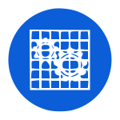 | Verify Guards in Place 
|3|  | Sound Horn 
|4| 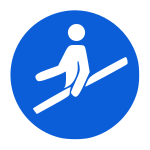 | Use Handrail 
|5|  | Connect EarthTerminal to Ground 
|6|  | Pay Attention This is Mandatory 
|7|  | Use Gas Detector 
|8| 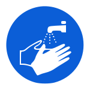 | Wash Hands 
|9|  | Refer to Instruction Manual 
|10|  | Wear Opaque Eye Protection 
|11|  | Wear Hardhat 
|12| 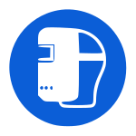 | Wear Welding Mask 
|13| 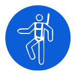 | Wear Safety Harness 
|14| 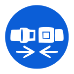 | Wear Seat Belt 
|15|  | Wear Respiratory Protection  |  X
|16|  | Disconnect Before Performing Maintainance or Repair 
|17| 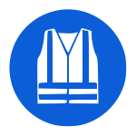 | Wear High Visibility Clothing  
|18| 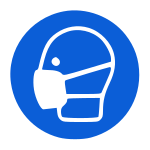 | Wear Mask  
|19| 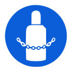 | Secure Gas Cylinder  |  X
|20| 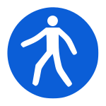 | Use This Walkway  
|21| 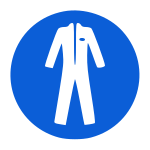 | Wear Protective Clothing  
|22| 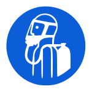 | Use Self-Contained Breathing Apparatus  
|23| 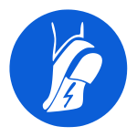 | Wear Anti-Static Shoes |  X
|24|  | Wear Eye Protection  
|25| 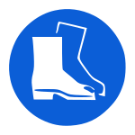 | Wear Safety Shoes  
|26| 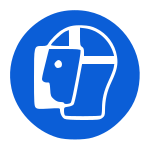 | Wear Face Shield  
|27| 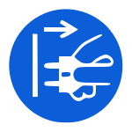 | Disconnect Mains Plug from Outlet 
|28| 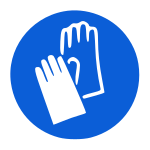 | Wear Protective Gloves 

