# HSE-Font

This repository provides fonts for your HSE projects. You can use it for your PowerPoint presentations, documents and Web projcts.

## Formats 
Fontface for HSE in format:
- TTF
- WOFF
- SVG

## Customizations 

Customizable sizes and colors;

# Usage

Importing the font:

	@font-face {
		  font-family: 'hse';
		  src: url('./font/hse.eot?21974651');
		  src: url('./font/hse.eot?21974651#iefix') format('embedded-opentype'),
			   url('./font/hse.woff?21974651') format('woff'),
			   url('./font/hse.ttf?21974651') format('truetype'),
			   url('./font/hse.svg?21974651#hse') format('svg');
		  font-weight: normal;
		  font-style: normal;
		}

Defining HTML icon

	<i class="demo-icon hse-verify-guards-in-place">&#xe800;</i>	

# Icons

Icon list below.

| # | Icon | Description |
|--------|--------|--------|
|01|  | Wear EarProtection 
|02|  | Verify Guards in Place 
|03|  | Sound Horn 
|04|  | Use Handrail 
|05|  | Connect EarthTerminal to Ground 
|06|  | Pay Attention This is Mandatory 
|07|  | Use Gas Detector 
|08|  | Wash Hands 
|09|  | Refer to Instruction Manual 
|10|  | Wear Opaque Eye Protection 
|11|  | Wear Hardhat 
|12|  | Wear Welding Mask 
|13|  | Wear Safety Harness 
|14|  | Wear Seat Belt 
|15|  | Wear Respiratory Protection  
|16|  | Disconnect Before Performing Maintainance or Repair 
|17|  | Wear High Visibility Clothing  
|18|  | Wear Mask  
|19|  | Secure Gas Cylinder  
|20|  | Use This Walkway  
|21|  | Wear Protective Clothing  
|22|  | Use Self-Contained Breathing Apparatus  
|23|  | Wear Anti-Static Shoes 
|24|  | Wear Eye Protection  
|25|  | Wear Safety Shoes  
|26|  | Wear Face Shield  
|27|  | Disconnect Mains Plug from Outlet 
|28|  | Wear Protective Gloves 
|29| 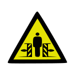 | Crush Hazard
|30| 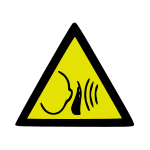 | Sudden Loud Noises
|31| 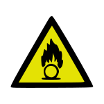 | Oxadizing Agent
|32| 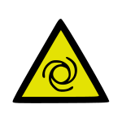 | Automatic Start-Up
|33|  | Magnetic Field
|34| 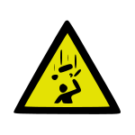 | Falling Objects
|35| 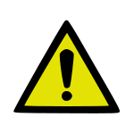 | Warning
|36| 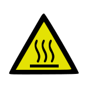 | Hot Surface
|37| 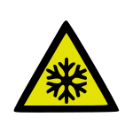 | Low Temperature
|38| 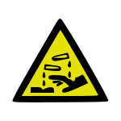 | Corrosive
|39| 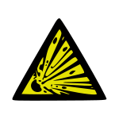 | Explosive
|40| 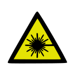 | Laser Light
|41| 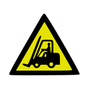 | Industrial Vehicles
|42| 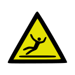 | Slippery Surface
|43| 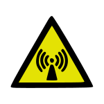 | Non-Ionizing Radiation
|44| 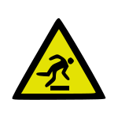 | Trip Hazard
|45| 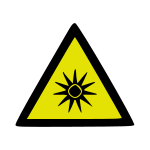 | Optical Radiation
|46| 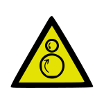 | Rollers
|47| 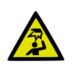 | Overhead Obstacles
|48| 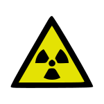 | Radioactive (Ionizing Radiation)
|49| 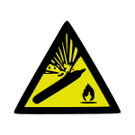 | CompressedGas Cylinder
|50| 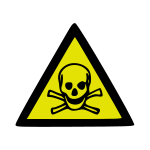 | Toxic
|51| 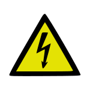 | High Voltage
|52| 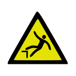 | Fall Hazard
|53| 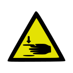 | Hand Crush Hazard
|54| 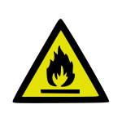 | Flamable
|55| 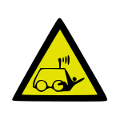 | Remotely Operated Vehicle
|56| 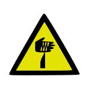 | Sharp Object
|57| 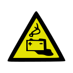 | Battery Charging
|58| 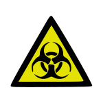 | Biological Hazard
|59| 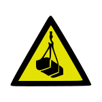 | Overhead Loads

# Feedback 

I am available:

| Availble at: | Link                                 |
| ------------ | ------------------------------------ |
| Twitter      | https://twitter.com/paulospx         |
| LinkedIn     | https://www.linkedin.com/in/ppaixao/ |

Coded with ❤

